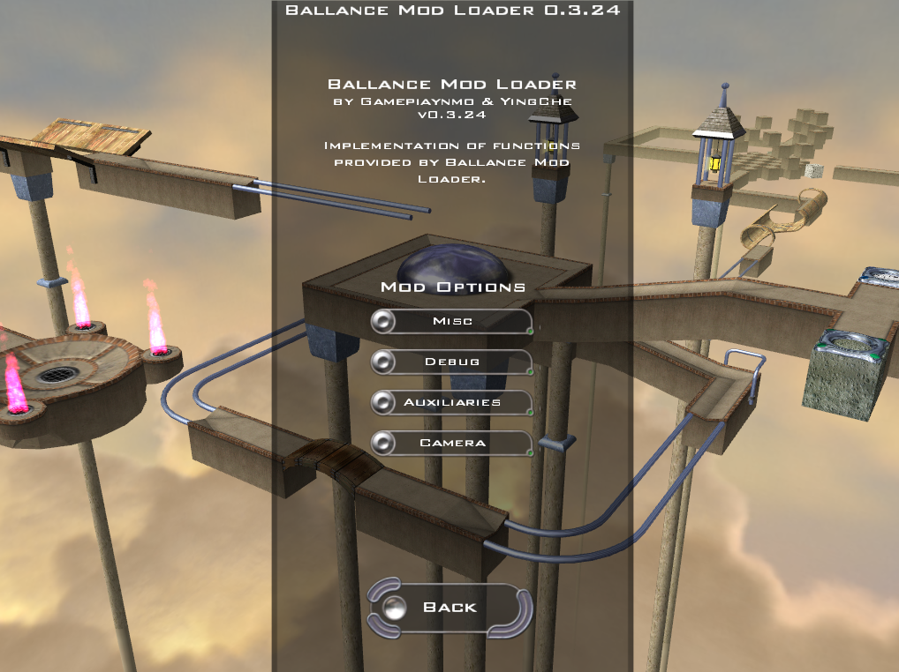
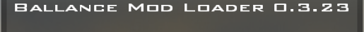

# Ballance Mod Loader

If you play Minecraft and have heard of Forge, then you would easily understand what BML means to Ballance.

Ballance Mod Loader is a free, open-source modding API used to extend the content of original Ballance game.

For more information, please read [The Wiki](https://github.com/Gamepiaynmo/BallanceModLoader/wiki).

The source code of built-in mods is in [another repository](https://github.com/Gamepiaynmo/BML-Mods).

### Installing

Go to the Release page and download the latest build (Do not download the dev package unless you would like to develop your own mod). Extract all contents into your Ballance root folder. After that you can find the following files in your Ballance directory:

* BML.dll in BuildingBlocks directory;
* ModLoader directory.

Before launching the game please check if the compatibility mode of Player.exe is at least Windows XP (Windows 7, Windows 8, etc.). If everything goes well, then you can see the message of BML on the top.

### Uninstalling

Go to Ballance root folder, and delete BML.dll in BuildingBlocks directory. If you would like to remove the entire data of BML (installed mods, maps, configs etc.), delete the ModLoader folder as well.

### Building

* Clone this repository.
* Open BML.sln with Visual Studio 2019.
* Go to Project Properties -> C/C++ -> Precompile Header, and disable it.
* Set building configuration to Release, x86.
* Change the output path to what you want.
* Build the solution.

### Troubleshooting

If your game crashes after installing BML, or you have met bugs playing with BML, please raise a new Issue at GitHub, with the following information:

* Describe the condition you met in detail;
* Screenshots to help explaining if possible;
* Paste the content of ModLoader.log (in ModLoader folder).